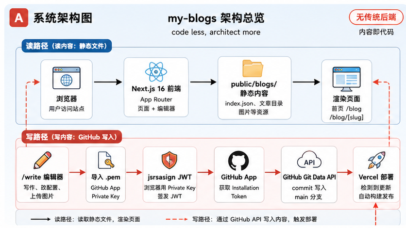
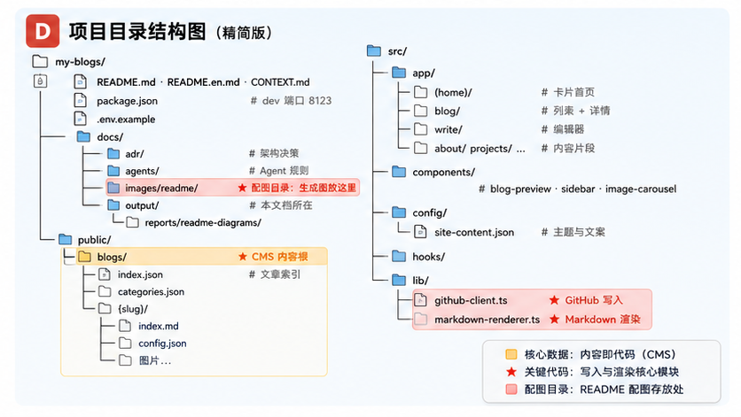
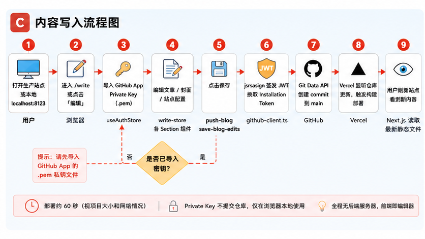
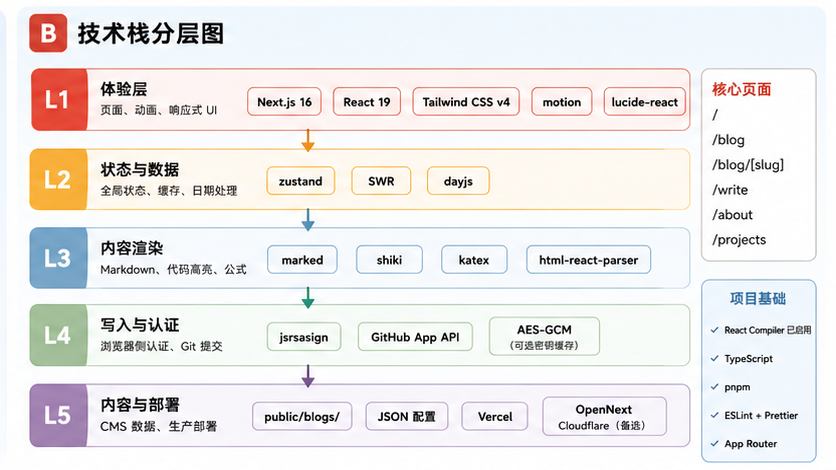

<p align="center">
  <h1 align="center">my-blogs</h1>
  <p align="center"><em>code less, architect more</em></p>
  <p align="center">threetwoa 的个人博客，也是一块可以随便折腾的前端实验田。<br>文章丢在 GitHub，浏览器里写完就发布，不用每次开 IDE。</p>
</p>

<p align="center">
  
</p>

<p align="center">
  <a href="README.md"></a>
  <a href="README.en.md"></a>
  <a href="https://my-blogs-roan-seven.vercel.app"></a>
  <a href="https://github.com/Aafff623/my-blogs"></a>
  
  
  
</p>

<p align="center">
  <a href="#灵感与初衷">灵感</a> ·
  <a href="#能做什么">能做什么</a> ·
  <a href="#看看长什么样">截图</a> ·
  <a href="#跑起来">跑起来</a> ·
  <a href="#架构与结构">架构</a> ·
  <a href="#技术栈">技术栈</a> ·
  <a href="#还在改什么">还在改什么</a> ·
  <a href="#相关文档">文档</a>
</p>

---

## 灵感与初衷

我想要一个**真正属于自己的角落**——能记学习笔记，能挂 Three.js / Shader 小实验，也能随手写点日常，还不想被沉重 CMS 绑住。

后来 fork 了 [YYsuni/2025-blog-public](https://github.com/YYsuni/2025-blog-public)，看中的不是「又一个模板」，而是这条很轻的路：

```text
浏览器写完 → GitHub 落 commit → Vercel 自动部署 → 站点就更新了
```

接了自己的仓库和 GitHub App 之后，慢慢改成现在这套：**卡片首页、文章时间线、浏览器编辑器、多图封面**。写博客不必像交作业，改界面可以当成 side project 慢慢磨。

> 一句话：**少写样板代码，多留点空间给真正想做的事。**

---

## 能做什么

| 功能 | 一句话 |
|---|---|
| **卡片首页** | 模块可拖拽，主题色、背景、艺术图都能在线换 |
| **文章时间线** | 按日 / 周 / 月 / 年 / 分类翻文章，带日历热力图 |
| **Markdown 阅读** | 代码高亮、数学公式、目录侧栏、封面轮播 |
| **浏览器写作** | `/write` 边写边看，封面、标签、图片都能管 |
| **GitHub 当后台** | 导入 Private Key，保存就是 commit，有完整 Git 历史 |
| **其它片段** | about、projects、pictures、share 等也能在线改 |
| **已读标记** | 看过哪篇，时间线上会悄悄记下来 |

---

## 看看长什么样

线上地址：[my-blogs-roan-seven.vercel.app](https://my-blogs-roan-seven.vercel.app)

截图放在 `docs/images/readme/`（Playwright 截取，点击可放大）：

| | | |
|:---:|:---:|:---:|
| [](docs/images/readme/home.jpg)<br><br>**首页**<br>卡片布局 · 猫猫 art 图 · 社交入口 | [](docs/images/readme/blog.jpg)<br><br>**文章时间线**<br>双栏布局 · 年/月/日/分类切换 | [](docs/images/readme/article.jpg)<br><br>**文章页**<br>Markdown 正文 · 侧栏目录与封面<br>[示例](https://my-blogs-roan-seven.vercel.app/blog/curve-arrow) |

随便逛逛的建议路线：首页 → `/blog` 切几个视图 → 点开一篇文章 → 本地跑起来看看 `/write`

---

## 跑起来

```bash
git clone https://github.com/Aafff623/my-blogs.git
cd my-blogs
pnpm install
pnpm dev
```

浏览器打开 [http://localhost:8123](http://localhost:8123)。本地端口是 **8123**，写在 `package.json` 里。

| 命令 | 干嘛的 |
|---|---|
| `pnpm dev` | 开发模式，`localhost:8123` |
| `pnpm build` | 构建 |
| `pnpm start` | 跑生产构建 |
| `pnpm run svg` | 重新生成 SVG 索引 |
| `pnpm run build:cf` | Cloudflare 版构建 |

<details>
<summary>Windows 注意一下</summary>

```powershell
git clone https://github.com/Aafff623/my-blogs.git
cd my-blogs
pnpm install
pnpm dev
```

8123 被占了就先杀进程，或者：

```powershell
pnpm exec next dev --turbopack -p 8123
```

</details>

<details>
<summary>环境变量（部署 / 线上编辑才需要）</summary>

```bash
cp .env.example .env.local
```

| 变量 | 当前值 |
|---|---|
| `NEXT_PUBLIC_GITHUB_OWNER` | `Aafff623` |
| `NEXT_PUBLIC_GITHUB_REPO` | `my-blogs` |
| `NEXT_PUBLIC_GITHUB_BRANCH` | `main` |
| `NEXT_PUBLIC_GITHUB_APP_ID` | `4213335` |

`.pem` 私钥只在浏览器编辑时临时导入，**别提交进仓库，也别塞进 Vercel**。

</details>

<details>
<summary>想在线上直接改文章？</summary>

```text
打开站点 → 点编辑 → 导入 .pem → 改内容 → 保存
→ GitHub 收到 commit → 等 Vercel 部署（大概一分钟）
```

写文章、换封面、调首页——线上搞定。改组件、动架构——本地分支搞完再合。

原项目教程：[yysuni.com/blog/readme](https://www.yysuni.com/blog/readme)

</details>

---

## 架构与结构

### 系统架构



```text
【读】浏览器 → Next.js → public/blogs/ 静态文件 → 页面渲染
【写】/write 编辑器 → .pem → JWT → GitHub App → Git API → commit → Vercel 部署
```

### 目录结构



核心路径：

| 路径 | 干什么 |
|---|---|
| `public/blogs/` | 所有文章、索引、分类——CMS 数据根 |
| `public/blogs/{slug}/` | 单篇文章：`index.md` + `config.json` + 图片 |
| `src/app/(home)/` | 卡片式首页 |
| `src/app/blog/` | 时间线列表 + 文章详情 |
| `src/app/write/` | 浏览器编辑器 |
| `src/lib/github-client.ts` | GitHub 写入（JWT、commit） |
| `src/lib/markdown-renderer.ts` | Markdown 渲染唯一入口 |
| `src/config/site-content.json` | 主题色、社交链接、卡片配置 |

### 内容写入流程



```text
打开站点 → /write → 导入 .pem → 编辑 → 保存
  → GitHub commit → Vercel 部署（~60s）→ 刷新可见
```

---

## 技术栈



| 层 | 技术 | 负责什么 |
|---|---|---|
| **体验层** | Next.js 16 · React 19 · Tailwind CSS v4 · motion · lucide-react | 页面路由、组件、动画、响应式 |
| **状态层** | zustand · SWR · dayjs | 编辑器状态、博客索引缓存、日期格式化 |
| **渲染层** | marked · shiki · katex · html-react-parser | Markdown 解析、代码高亮、数学公式 |
| **写入层** | jsrsasign · GitHub App API · AES-GCM | 浏览器签发 JWT、Installation Token、可选密钥加密缓存 |
| **内容层** | `public/blogs/` · JSON 配置 | 文章元数据、正文、图片——静态 CMS |
| **部署层** | Vercel · OpenNext + Cloudflare（备选） | 生产构建与发布 |

**工具链**：TypeScript · pnpm · React Compiler · Turbopack（`pnpm dev` 端口 `8123`）

---

## 还在改什么

| 阶段 | 状态 | 备注 |
|---|---|---|
| 接自己的仓库 & 部署 | ✅ | GitHub App、Vercel、环境变量都换好了 |
| 文章时间线 | ✅ | 双栏、热力图、分类树 |
| 多图封面 | 🔄 | `covers` + 侧栏轮播 |
| README & 配图 | ✅ | Banner · 截图 · 架构/技术栈/流程/结构图 |
| 视觉细节 | 🔜 | 暗色模式、动效、首页卡片还在磨 |

---

## 相关文档

| 文件 | 内容 |
|---|---|
| [`README.en.md`](README.en.md) | 英文版说明 |
| [`CONTEXT.md`](CONTEXT.md) | 术语、约束、目录结构 |
| [`CLAUDE.md`](CLAUDE.md) | Agent 协作用 |
| [`.env.example`](.env.example) | 环境变量模板 |
| [`AGENTS.md`](AGENTS.md) | 跨 Agent 工具入口 |
| [`docs/output/reports/readme-diagrams/readme-diagram-brief.md`](docs/output/reports/readme-diagrams/readme-diagram-brief.md) | README 架构/技术栈配图生成说明（拖给 GPT） |
| [`docs/README.md`](docs/README.md) | 文档资产索引 |
| [`docs/adr/`](docs/adr/) | 架构决策 |
| [`src/config/site-content.json`](src/config/site-content.json) | 站点主题与文案 |

---

## 致谢

- 底子来自 [YYsuni/2025-blog-public](https://github.com/YYsuni/2025-blog-public)
- License 见 [`LICENSE`](LICENSE)

---

[threetwoa](https://github.com/Aafff623) · _code less, architect more_
