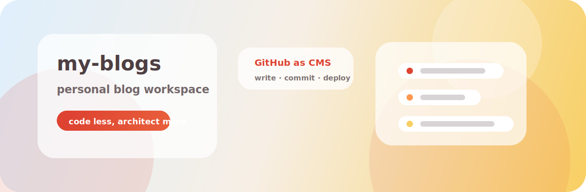
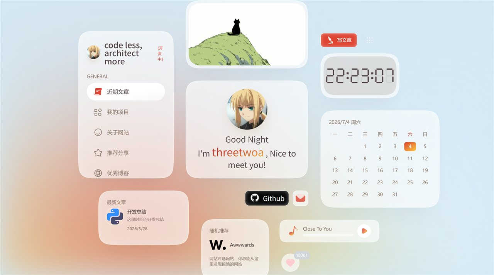
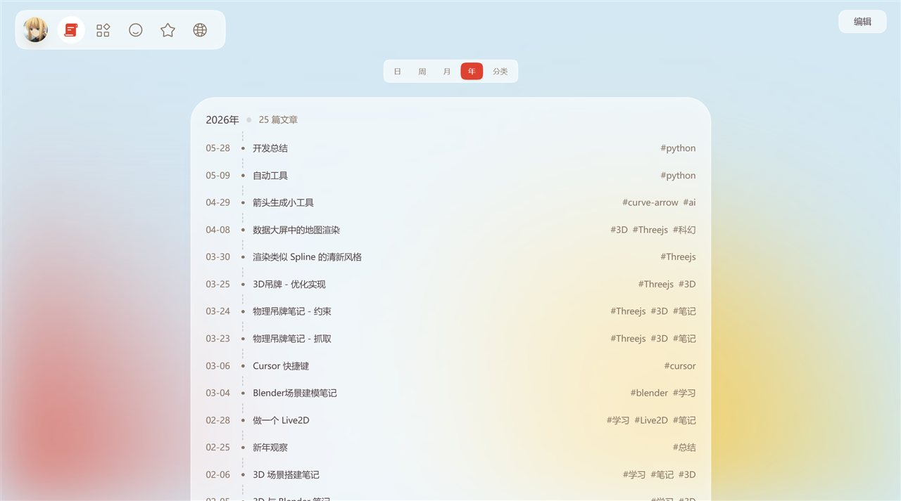
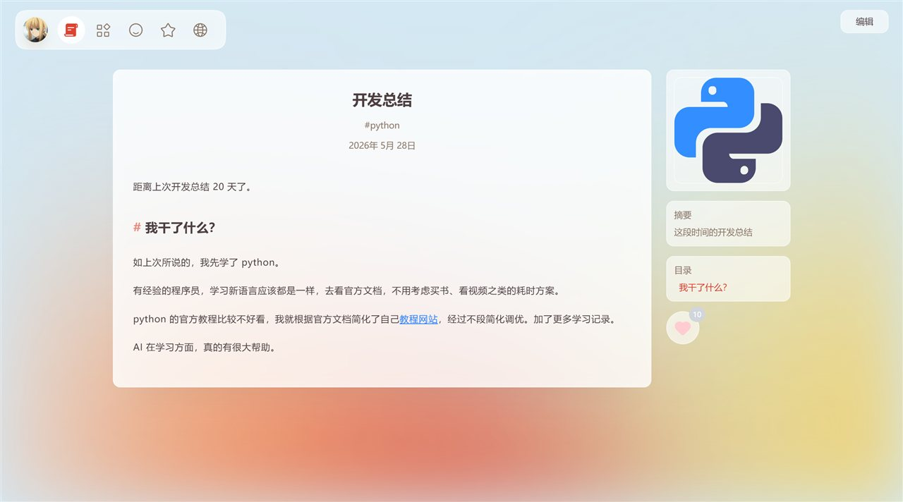

<p align="center">
  
</p>

<p align="center">
  <a href="https://my-blogs-roan-seven.vercel.app"></a>
  <a href="https://github.com/Aafff623/my-blogs"></a>
  
  
  
</p>

<p align="center">
  <strong>把一个开源博客轮子，改造成自己的内容工作台。</strong><br>
  GitHub 存内容，Vercel 做发布，浏览器负责日常写作与配置。
</p>

<p align="center">
  <a href="#origin">Origin</a> ·
  <a href="#showcase">Showcase</a> ·
  <a href="#workflow">Workflow</a> ·
  <a href="#develop">Develop</a> ·
  <a href="#architecture">Architecture</a> ·
  <a href="#notes">Notes</a>
</p>

---

## Origin

这个仓库 fork 自 [YYsuni/2025-blog-public](https://github.com/YYsuni/2025-blog-public)。原项目最打动我的地方，不是“又一个博客模板”，而是它把个人博客的维护方式做轻了：

```text
浏览器写作 → GitHub 产生 commit → Vercel 自动部署 → 独立站点更新
```

我把它接到自己的 GitHub App、仓库和 Vercel 项目上，再继续改首页、内容组织和项目文档。现在它的定位更明确：**这是 threetwoa 的个人博客工作台，也是一个可以继续拆开研究的前端实验场。**

它坚持三条边界：

| 原则 | 说明 |
|---|---|
| **内容归自己** | 文章、图片、配置都落在 `Aafff623/my-blogs`，每次编辑都有 Git 历史 |
| **日常编辑要轻** | 写文章、改封面、调首页配置，不必每次打开 IDE |
| **复杂改动走本地** | 新组件、布局实验、认证逻辑仍然在本地分支里验证 |

## Showcase

| Home | Blog | Article |
|:---:|:---:|:---:|
| [](docs/images/readme/home.jpg) | [](docs/images/readme/blog.jpg) | [](docs/images/readme/article.jpg) |
| 卡片式首页 · 个人化入口 | 时间线文章列表 · 分类聚合 | Markdown 阅读页 · 目录与摘要 |

Live site: [https://my-blogs-roan-seven.vercel.app](https://my-blogs-roan-seven.vercel.app)

## Workflow

线上编辑不是绕过源码，而是让前端帮我完成一次结构化的 Git 写入。

```text
打开生产站点
  → 点击编辑入口
  → 导入 GitHub App Private Key
  → 修改文章 / 图片 / 配置
  → 保存为 GitHub commit
  → Vercel 重新部署
```

适合在线完成：

- 写文章、改文章、上传文章图片
- 修改首页主题色、头像、社交按钮、艺术图
- 维护 projects、share、pictures、about 等结构化内容

适合本地完成：

- 改页面结构、复杂交互和视觉系统
- 新增组件或重构数据模型
- 修改 GitHub App 认证与写入流程

## Develop

```bash
git clone https://github.com/Aafff623/my-blogs.git
cd my-blogs
pnpm install
pnpm dev
```

本地开发地址：

[http://localhost:2025](http://localhost:2025)

常用命令：

| 命令 | 说明 |
|---|---|
| `pnpm dev` | 启动开发服务器 |
| `pnpm build` | 构建 Next.js 应用 |
| `pnpm start` | 启动生产构建 |
| `pnpm run svg` | 重新生成 SVG 图标索引 |

生产环境变量：

| 变量 | 当前值 | 说明 |
|---|---|---|
| `NEXT_PUBLIC_GITHUB_OWNER` | `Aafff623` | GitHub 用户名 |
| `NEXT_PUBLIC_GITHUB_REPO` | `my-blogs` | 内容仓库 |
| `NEXT_PUBLIC_GITHUB_BRANCH` | `main` | 线上写入分支 |
| `NEXT_PUBLIC_GITHUB_APP_ID` | `4213335` | GitHub App ID |

> `NEXT_PUBLIC_*` 会进入前端 bundle。真正的 `.pem` Private Key 只在浏览器编辑时临时使用，不提交仓库，也不放进 Vercel。

## Architecture

```text
Next.js App Router
  → Browser editor
    → GitHub App JWT
      → Installation Token
        → Git Data API
          → commit to main
            → Vercel production deployment
```

| 层 | 技术 | 说明 |
|---|---|---|
| Frontend | Next.js 16 · React 19 · Tailwind CSS v4 | App Router、卡片首页、编辑器 |
| Content | `public/blogs/` · JSON config | 文章、图片、分类与页面数据 |
| Rendering | marked · shiki · katex | Markdown、代码高亮、数学公式 |
| Auth | GitHub App · jsrsasign · AES-GCM | 浏览器侧签发 JWT，可选缓存私钥 |
| Deploy | Vercel | `main` 分支更新后自动部署 |

文章模型：

```text
public/blogs/{slug}/
├── index.md
├── config.json
└── images...
```

## Notes

- 原作者教程：[https://www.yysuni.com/blog/readme](https://www.yysuni.com/blog/readme)
- 架构决策记录在 [`docs/adr/`](docs/adr/)
- Agent 协作说明在 [`CLAUDE.md`](CLAUDE.md) 与 [`docs/agents/`](docs/agents/)
- License 继承原仓库，见 [`LICENSE`](LICENSE)

---

Made for a quieter, more durable personal web.
